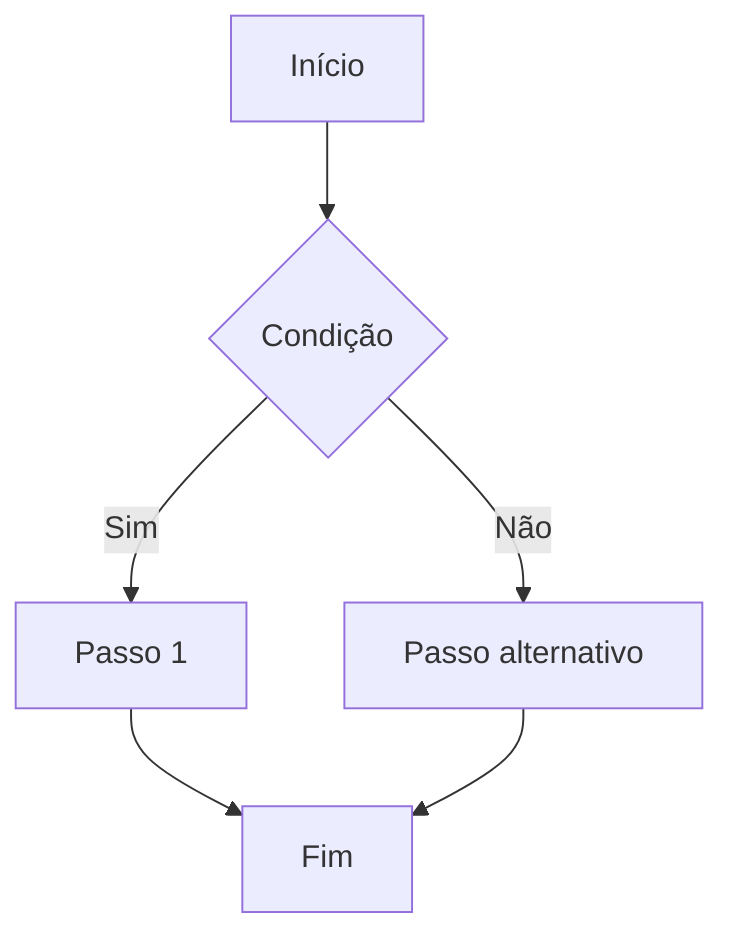

# Skill: /plan-task

## Acionamento

```
/plan-task "descrição da tarefa"
```

Sem descrição, peça antes de continuar.

## Diretriz de resposta

Seja completo mas sucinto. Omita explicações óbvias, prefira listas e diagramas a parágrafos. Economize tokens sem perder precisão técnica.

## Leitura de contexto do projeto

Leia **se existirem**:

- `.claude/project.md` — stack, ambientes, módulos
- `.claude/conventions.md` — padrões do time
- `.claude/architecture.md` — decisões técnicas
- `.claude/known-issues.md` — armadilhas conhecidas

Se não existirem, informe e continue com contexto genérico.

## O que produzir

### 1. Entendimento da tarefa

Reformule em 2–3 linhas. Liste premissas assumidas se houver ambiguidade.

### 2. Fluxograma da implementação

Gere um diagrama Mermaid representando o fluxo principal da tarefa. Use `flowchart TD` para tarefas sequenciais ou `flowchart LR` para fluxos de dados/integrações. Escolha o tipo mais adequado ao contexto.

Exemplos de uso:

- Feature com múltiplos passos → `flowchart TD` com decisões e ramificações
- Integração entre serviços → `flowchart LR` com sistemas como nós
- Job assíncrono → sequência com filas e estados



### 3. Arquivos e módulos envolvidos

| Arquivo/Pasta                            | Ação      | Motivo        |
| ---------------------------------------- | --------- | ------------- |
| `app/Models/Foo.php`                     | Criar     | Novo model    |
| `app/Http/Controllers/FooController.php` | Modificar | Novo endpoint |

### 4. Dependências e pré-requisitos

O que precisa existir antes de começar: migrations, serviços externos, permissões, feature flags.

### 5. Checklist de implementação

```
[ ] Passo 1 — descrição clara
[ ] Passo 2 — descrição clara
...
```

Cada item deve ser pequeno o suficiente para ser feito e testado isoladamente.

### 6. Edge cases e riscos

Liste apenas os relevantes, por impacto. Se houver fluxo de erro complexo, adicione um segundo diagrama Mermaid.

### 7. Critérios de aceitação

Como saber que está pronto. Verificável, não subjetivo.

### 8. Estimativa

Otimista / Realista / Pessimista. Justifique se > 1 dia.

## Comportamento com descrição

Use a descrição para:

- Identificar tipo (feature / bug / refactor / infra)
- Ajustar nível de detalhe
- Detectar módulos pelo nome e cruzar com `.claude/architecture.md`
