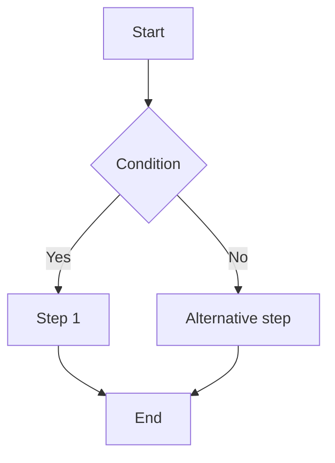

# Skill: /plan-task

## Trigger

```
/plan-task "task description"
```

Without a description, ask before continuing.

## Response guidelines

Be comprehensive but concise. Omit obvious explanations, prefer lists and diagrams to paragraphs. Avoid unnecessary text.

## Reading project context

Read **if they exist**:

- `.claude/project.md` — stack, environments, modules
- `.claude/conventions.md` — team standards
- `.claude/architecture.md` — technical decisions
- `.claude/known-issues.md` — known pitfalls

If they don't exist, inform and continue with generic context.

## What to produce

### 1. Task understanding

Rephrase in 2–3 lines. List assumed premises if there's ambiguity.

### 2. Implementation flowchart

Generate a Mermaid diagram representing the main task flow. Use `flowchart TD` for sequential tasks or `flowchart LR` for data/integration flows. Choose the type most suitable to the context.

Usage examples:

- Feature with multiple steps → `flowchart TD` with decisions and branches
- Integration between services → `flowchart LR` with systems as nodes
- Async job → sequence with queues and states



### 3. Files and modules involved

| File/Folder                              | Action   | Reason      |
| ---------------------------------------- | -------- | ----------- |
| `app/Models/Foo.php`                     | Create   | New model   |
| `app/Http/Controllers/FooController.php` | Modify   | New endpoint|

### 4. Dependencies and prerequisites

What needs to exist before starting: migrations, external services, permissions, feature flags.

### 5. Implementation checklist

```
[ ] Step 1 — clear description
[ ] Step 2 — clear description
...
```

Each item should be small enough to be done and tested independently.

### 6. Edge cases and risks

List only the relevant ones, by impact. If there's complex error flow, add a second Mermaid diagram.

### 7. Acceptance criteria

How to know it's done. Verifiable, not subjective.

## Behavior with description

Use the description to:

- Identify type (feature / bug / refactor / infra)
- Adjust level of detail
- Detect modules by name and cross-reference with `.claude/architecture.md`
